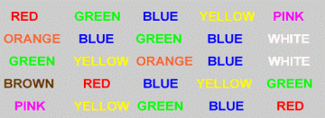

# Stroop Effect 
The famous "Stroop Effect" is named after J. Ridley Stroop who discovered this strange phenomenon in the 1930s. Here is your job: name the colors of the following words. Do NOT read the words...rather, say the color of the words. For example, if the word "BLUE" is printed in a red color, you should say "RED". Say the colors as fast as you can. It is not as easy as you might think!

https://wave-rider.github.io/StroopEffect/index.html

## screenshot

### Credits
To create this project I used:

[youtube](https://youtu.be/N3Fmwf8ylrs)

https://github.com/candraKriswinarto/firestore-crud

https://faculty.washington.edu/chudler/java/ready.html
